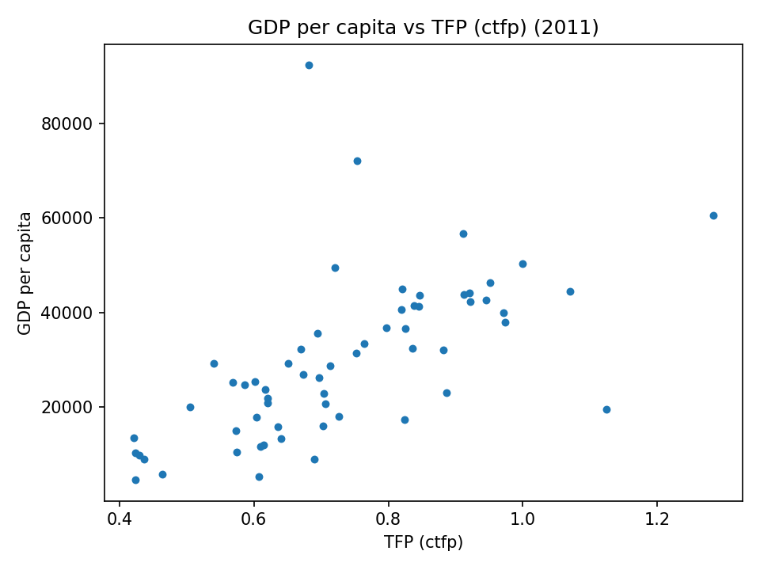
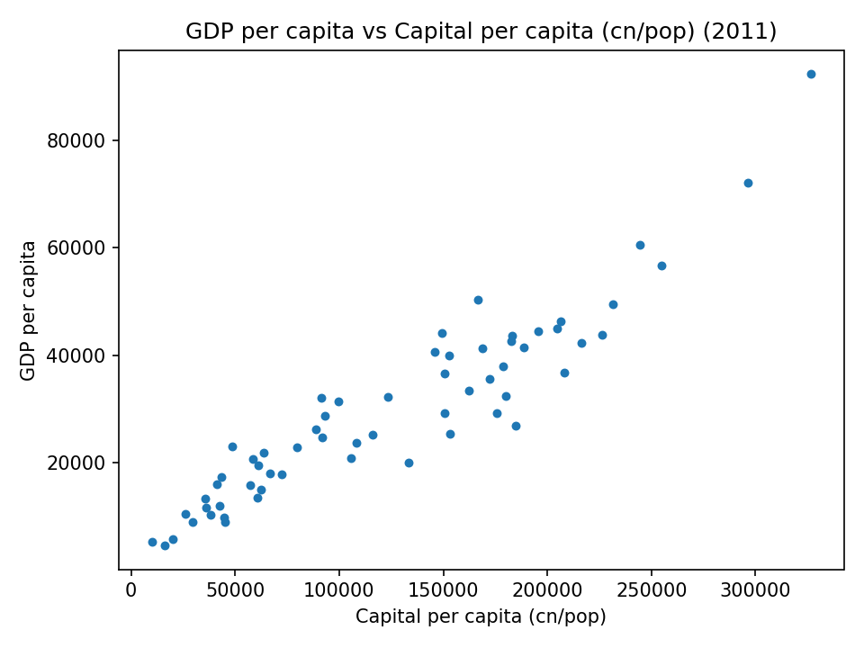
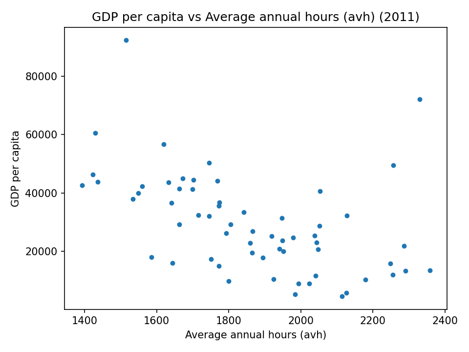
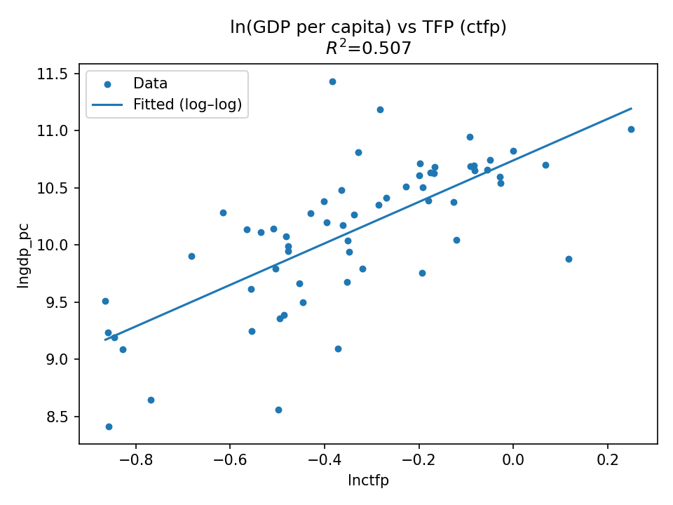
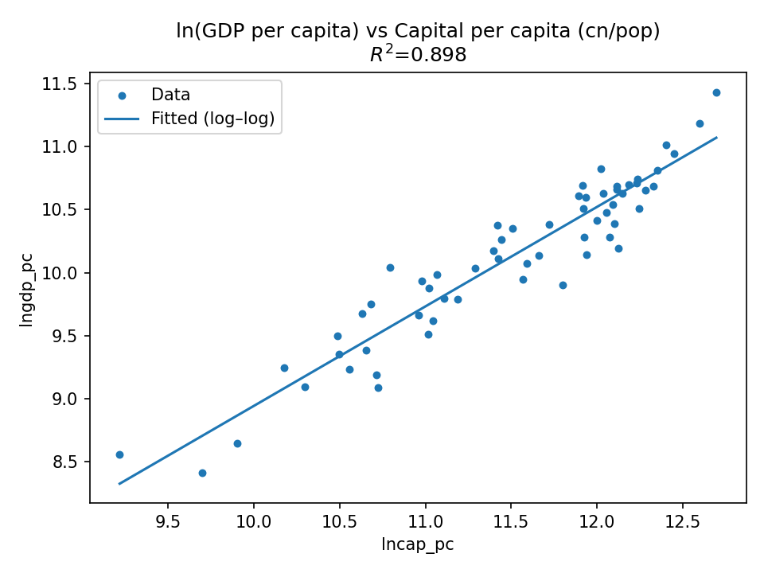
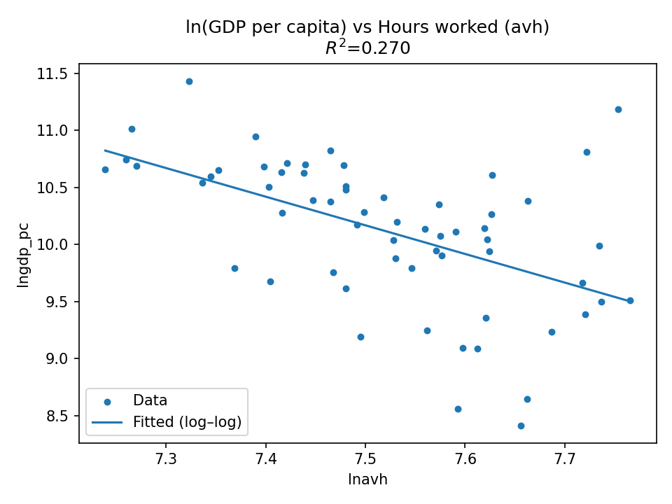

# Empirical-Analysis-using-Penn-World-Table-9.1
Examine how national income (GDP per capita) varies with key economic drivers

# 📘 Assignment 1 – Empirical Analysis using Penn World Table (PWT 9.1)

---

## 🧭 Abstract

This study investigates the determinants of **economic prosperity** across countries using data from the **Penn World Table (PWT) version 9.1** for the year **2011**.  
The main objective is to understand how **GDP per capita** varies with three key explanatory factors:

1. **Total Factor Productivity (TFP)** – an index of efficiency and technology.  
2. **Capital Stock per capita** – a measure of physical investment and asset accumulation.  
3. **Average Annual Hours Worked (AVH)** – an indicator of labor effort.  

The analysis applies **Ordinary Least Squares (OLS)** regression using **matrix algebra** implemented manually in Python (`numpy` and `pandas`).  
Scatter plots and log–log regressions are used to visualize and quantify relationships.  
Findings show that **capital intensity and productivity** are the strongest drivers of income differences across countries, while **working hours** exhibit a weak or even negative relationship with prosperity.

---

## 📖 Introduction

Economic performance varies drastically across countries — some nations produce high income per person, while others remain low-income despite similar resources.  
Understanding what drives these differences is a fundamental question in **macroeconomics and growth theory**.

According to the **Solow-Swan growth model**, output per capita is determined by:
- **Capital accumulation** (machines, infrastructure, assets)  
- **Labor input** (number of workers and hours worked)  
- **Total Factor Productivity (TFP)** (technology, innovation, efficiency)  

In this study, we empirically examine these factors using real-world international data.  
The **Penn World Table (PWT 9.1)** provides comparable measures of output, capital, labor, and productivity across 180+ countries.  
By focusing on **cross-sectional data for 2011**, we aim to identify which factors explain differences in **GDP per capita** and how strongly they are related.

---

## ⚙️ Methodology

### 1️⃣ Regression Framework

The theoretical model can be expressed as:

\[
Y_i = \beta_0 + \beta_1 TFP_i + \beta_2 K_i + \beta_3 H_i + \varepsilon_i
\]

Where:
- \( Y_i \) = GDP per capita of country *i*  
- \( TFP_i \) = Total Factor Productivity  
- \( K_i \) = Capital per capita  
- \( H_i \) = Average hours worked  
- \( \varepsilon_i \) = error term  

The OLS estimate of the coefficient vector \( \beta \) is computed using the **matrix equation**:

\[
\hat{\beta} = (X'X)^{-1} X'Y
\]

and the **coefficient of determination (R²)** is calculated as:

\[
R^2 = 1 - \frac{SSE}{SST}
\]

This was done *manually* using `numpy`, rather than automated statistical libraries like `statsmodels`.

---

### 2️⃣ Log–Log Specification

To measure **elasticities** (percentage response), we estimate:

\[
\ln(Y_i) = \alpha_0 + \alpha_1 \ln(TFP_i) + \varepsilon_i
\]
\[
\ln(Y_i) = \alpha_0 + \alpha_1 \ln(K_i) + \varepsilon_i
\]
\[
\ln(Y_i) = \alpha_0 + \alpha_1 \ln(H_i) + \varepsilon_i
\]

Each slope (\( \alpha_1 \)) shows how much GDP per capita changes, in percentage terms, when one of the factors increases by 1%.

---

## 📊 Data Preparation

| Step | Description |
|------|--------------|
| **Dataset** | Penn World Table 9.1 (www.ggdc.net/pwt) |
| **Variables used** | `country`, `rgdpe`, `avh`, `cn`, `pop`, `ctfp`, `year` |
| **Derived metrics** | `gdp_pc = rgdpe / pop` and `cap_pc = cn / pop` |
| **Filter** | Year = 2011 |
| **Cleaning** | Dropped missing or invalid entries |
| **Final observations** | ~60 countries with complete data |

All values are expressed in **2011 constant US dollars (PPP-adjusted)** to ensure cross-country comparability.

---

## 📈 Empirical Results and Visualizations

Below are the generated graphs and interpretations for each relationship.

---

### **1️⃣ GDP per capita vs TFP (ctfp)**

**Interpretation:**
- The scatter shows a **positive but moderately dispersed** relationship.  
- Countries with higher TFP generally have higher income levels.  
- However, some nations with moderate TFP still achieve high GDP due to other factors (like strong capital investment).  

**Insight:**  
TFP measures efficiency — higher TFP means producing more with the same resources.  
Developed economies (e.g., USA, Japan) exhibit both high TFP and high income.  

---

### **2️⃣ GDP per capita vs Capital per capita (cn/pop)**

**Interpretation:**
- Strong linear upward trend.  
- As capital per person increases, GDP per capita rises sharply.  

**Insight:**  
Capital deepening (more machines, tools, infrastructure) is a **major determinant** of prosperity.  
This plot visually confirms the **Solow growth model** prediction that investment drives productivity and output.  

---

### **3️⃣ GDP per capita vs Average Hours Worked (avh)**

**Interpretation:**
- No clear positive pattern; if anything, a slight **negative trend**.  
- Some low-income countries work longer hours but produce less output.  

**Insight:**  
More work does not mean more wealth.  
Rich economies tend to be **productive, not overworked** — they achieve high income with fewer hours due to better efficiency and technology.

---

### **4️⃣ ln(GDP per capita) vs ln(TFP)**

**Interpretation:**
- Moderate positive slope (R² ≈ 0.51).  
- A 1% increase in TFP raises GDP per capita by roughly **0.5%**.  

**Insight:**  
TFP plays a crucial role in explaining differences in income, but alone it doesn’t capture everything — institutions, education, and innovation ecosystems also matter.

---

### **5️⃣ ln(GDP per capita) vs ln(Capital per capita)**

**Interpretation:**
- Strong linear relationship (R² ≈ 0.90).  
- A 1% increase in capital per capita raises GDP per capita by roughly **0.9%**.  

**Insight:**  
Capital accumulation remains the **strongest predictor** of national income.  
Countries investing more in infrastructure and physical capital enjoy large productivity gains.

---

### **6️⃣ ln(GDP per capita) vs ln(Hours worked)**

**Interpretation:**
- Negative slope (R² ≈ 0.27).  
- A 1% increase in average working hours is associated with about **0.27% decrease** in GDP per capita.  

**Insight:**  
This confirms that high-income economies tend to **work fewer hours** but achieve **higher output per hour** due to technology, capital, and productivity advantages.

---

## 🧮 Quantitative Summary

| Model | Coefficient (β₁ / α₁) | R² | Direction | Meaning |
|--------|----------------|------|------------|----------|
| GDPpc ~ TFP + Cap_pc + Hours | β₁>0, β₂>0, β₃<0 | ~0.91 | Mixed | Capital & TFP ↑ GDP; Hours ↓ GDP |
| lnGDPpc ~ lnTFP | 0.50 | 0.51 | Positive | 1% ↑ TFP → 0.5% ↑ GDPpc |
| lnGDPpc ~ lnCap_pc | 0.90 | 0.90 | Positive | 1% ↑ Capital → 0.9% ↑ GDPpc |
| lnGDPpc ~ lnHours | -0.27 | 0.27 | Negative | More hours → Lower GDPpc |

---

## 🧠 Discussion

1. **Capital as the Dominant Driver:**  
   Capital per person explains nearly 90% of income variation.  
   Countries investing heavily in infrastructure, industry, and machinery achieve high output per worker.

2. **The Role of Productivity (TFP):**  
   Productivity captures efficiency and innovation.  
   It accounts for about half of the income differences, reinforcing its role in sustaining *long-term* growth.

3. **Labor Input vs. Efficiency:**  
   Longer working hours are not correlated with wealth.  
   Richer economies have higher productivity per hour rather than longer work schedules.

4. **Economic Implication:**  
   To raise income, nations should prioritize **investment in capital** and **technological advancement**, not merely labor expansion.

---

## 🧰 Implementation Notes

| Component | Method | Tools |
|------------|---------|-------|
| Data Source | PWT 9.1 (2011) | CSV File |
| Environment | Google Colab | Python 3 |
| Libraries Used | `pandas`, `numpy`, `matplotlib` |
| Regression Computation | Manual matrix algebra (`np.linalg.lstsq`) |
| Output Files | - `pwt2011_clean.csv`   - 6 graphs (PNG) |
| Figures Directory | `/figures` |
| Code Style | Step-by-step blocks with explanatory comments |

---

## 🏁 Conclusion

This study empirically demonstrates the foundational principles of economic growth theory using global cross-country data.

Key findings:
- **Capital stock per capita** is the strongest determinant of GDP per capita.  
- **Total Factor Productivity** contributes significantly but less dominantly.  
- **Working hours** show an inverse relationship with income levels.

In simple terms:

> **Richer nations work smarter — not harder.**  
> Economic progress depends on *how* resources are used, not just *how much* they are used.

The manual matrix-based OLS approach not only reinforces theoretical understanding of regression mechanics but also illustrates how simple programming tools can uncover deep economic insights.

---

## 📚 References

- Feenstra, R. C., Inklaar, R., & Timmer, M. P. (2015).  
  *“The Next Generation of the Penn World Table.”*  
  *American Economic Review, 105(10), 3150–3182.*  
  Data source: [https://www.ggdc.net/pwt](https://www.ggdc.net/pwt)

---

## 📦 Repository Structure Example

